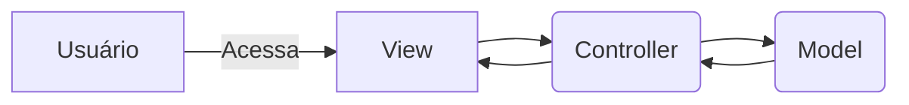

# Express 

Framework que ajuda na criação de aplicações utilizando o node. 

## MVC
 

# Express Generator

o Express generator cria a estrutura base da sua aplicação. 
- `$ npm install express-generator -g`
- `$ express [nome do projeto] --[template engine utilizada]`

