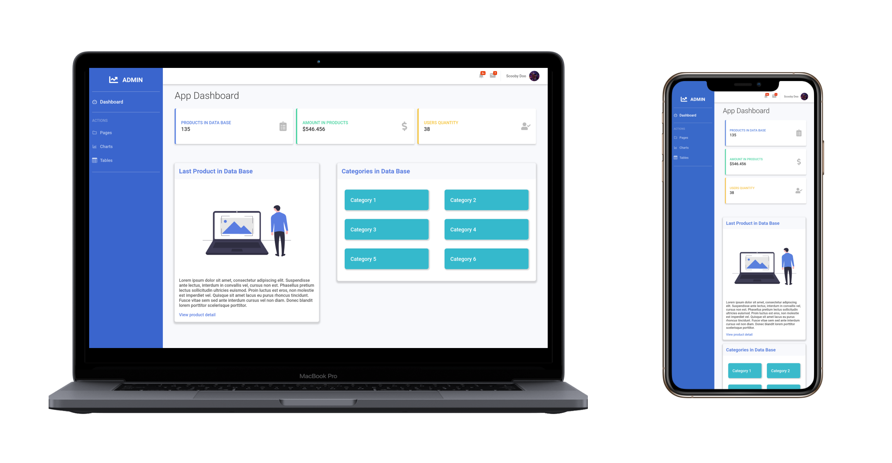

 

## :computer: Tecnologias

- [React Js;](https://pt-br.reactjs.org/)

## 🤠 Getting Started

Você precisa clonar o repositório, e pode fazer isso digitando em seu terminal `$ https://github.com/Luuck4s/Full-Stack-DigitalHouse.git`.
 

Logo após clonar o repositório navegue ate a pasta do projeto `$ cd React/dashboard ` e execute o comando `yarn install` ou `npm install`.

Logo após seguir tudo que foi feito acima pode executar o comando `yarn start` ou `npm start`, acesse `http://localhost:3000` para visualizar a aplicação.

--- 

<h5 align="center"> 🚀 Dashboard  by Luuck4s 💜 </h5>

---