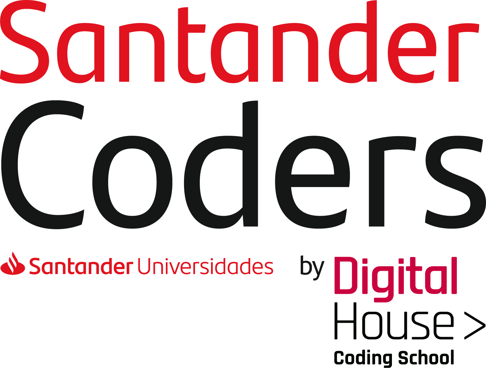

	

  
<h4  align="center">
	🔥 Desenvolvimento Web Full Stack 
</h4>

Neste repositório está o conteúdo do curso separado por pastas, dentro de cada pasta contém o Readme com links e utilidades para cada modulo.

## :bookmark: Módulos

### [Javascript Introdução](https://github.com/Luuck4s/Full-Stack-DigitalHouse/tree/master/Js-Introducao)

- #### [Introdução](https://github.com/Luuck4s/Full-Stack-DigitalHouse/tree/master/Js-Introducao//Introdução)
- #### [Arrow Functions](https://github.com/Luuck4s/Full-Stack-DigitalHouse/tree/master/Js-Introducao/ArrowFunctions)
- #### [Métodos Array](https://github.com/Luuck4s/Full-Stack-DigitalHouse/tree/master/Js-Introducao/Metodos%20Array)

### [CORS](https://github.com/Luuck4s/Full-Stack-DigitalHouse/tree/master/CORS)

### [Node](https://github.com/Luuck4s/Full-Stack-DigitalHouse/tree/master/Node)

- #### [NPM](https://github.com/Luuck4s/Full-Stack-DigitalHouse/tree/master/Node/NPM)
- #### [HTTP](https://github.com/Luuck4s/Full-Stack-DigitalHouse/tree/master/Node/Http)
- #### [Express](https://github.com/Luuck4s/Full-Stack-DigitalHouse/tree/master/Node/Express)

### [Html - Css](https://github.com/Luuck4s/Full-Stack-DigitalHouse/tree/master/Html-Css)

- #### [Pesqueiro Notredame](https://github.com/Luuck4s/Full-Stack-DigitalHouse/tree/master/Html-Css/Pesqueiro-Notredame)

- #### [Pizzaria Fantástica](https://github.com/Luuck4s/Full-Stack-DigitalHouse/tree/master/Html-Css/Pizzaria-Fantastica)

- #### [kitchening](https://github.com/Luuck4s/Full-Stack-DigitalHouse/tree/master/Html-Css/kitchening)

### [Express](https://github.com/Luuck4s/Full-Stack-DigitalHouse/tree/master/Express)

- #### [Pizzaria Fantástica](https://github.com/Luuck4s/Full-Stack-DigitalHouse/tree/master/Express/pizzaria)
- #### [Mailer](https://github.com/Luuck4s/Full-Stack-DigitalHouse/tree/master/Express/mailer)

### [Sequelize](https://github.com/Luuck4s/Full-Stack-DigitalHouse/tree/master/Sequelize)

- #### [Fake Instagram](https://github.com/Luuck4s/Full-Stack-DigitalHouse/tree/master/Sequelize/instagram)

### [Javascript Front](https://github.com/Luuck4s/Full-Stack-DigitalHouse/tree/master/JS-Front)

- #### [Jokenpo](https://github.com/Luuck4s/Full-Stack-DigitalHouse/tree/master/JS-Front/jokenpo)

- #### [Todom Simples](https://github.com/Luuck4s/Full-Stack-DigitalHouse/tree/master/JS-Front/todom)

- #### [Busca Cep](https://github.com/Luuck4s/Full-Stack-DigitalHouse/tree/master/JS-Front/busca_CEP)

- #### [Pokemon](https://github.com/Luuck4s/Full-Stack-DigitalHouse/tree/master/JS-Front/pokemon)

- #### [Todom 2.0](https://github.com/Luuck4s/Full-Stack-DigitalHouse/tree/master/JS-Front/todom-2.0)

### [Mongo](https://github.com/Luuck4s/Full-Stack-DigitalHouse/tree/master/mongo)

### [React](https://github.com/Luuck4s/Full-Stack-DigitalHouse/tree/master/React)

- #### [Dashboard Estática](https://github.com/Luuck4s/Full-Stack-DigitalHouse/tree/master/React/dashboard)

---

<h5 align="center"> 🚀  Web Full Stack   by Luuck4s 💜 </h5>

---
